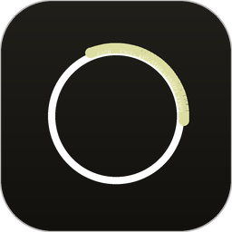
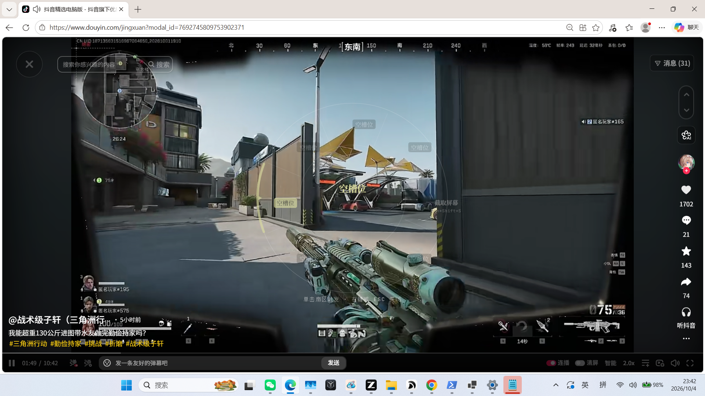
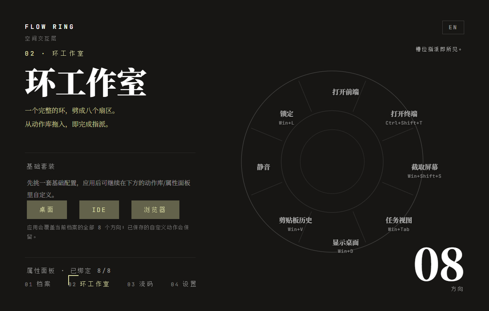

# Flow Ring

按住鼠标侧键唤出一个圆环，把光标拖向某个方向后松开，就能执行常用动作——不用离开当前窗口去翻菜单。

Flow Ring 是一个 Windows 桌面快捷环：环形菜单悬浮在任意应用之上，8 个方向各绑定一个动作，全部在本地运行。

---

## 亮点

- **8 向空间环**
  以光标位置为圆心唤出圆环，8 个方向 + 环心死区（默认 30 px），拖出方向即锁定高亮，松开执行；方向由与 OS 无关的核心解析，响应快、手感稳。

- **全屏游戏保护**
  检测到前台是全屏应用（游戏、演示）时，触发键被完全放行——不吞键、不弹环；退出全屏后自动恢复。

- **基础套装（一键预设）**
  内置「桌面 / IDE / 浏览器」三套 8 方向预设，点一下即可套用到当前档案：
  - 桌面：打开主界面、终端、截屏、任务视图、显示桌面、剪贴板历史、静音、锁定；
  - IDE：按 IntelliJ IDEA 默认键位预设（保存 / 运行 / 调试 / 全局查找 / 转到声明 / 格式化）；
  - 浏览器：按 Chrome / Edge 常见键位预设（新建 / 关闭 / 恢复标签页、地址栏、全屏）。
  套用后仍可逐槽自由修改，不会锁死。

- **自定义动作与快捷键**
  任意方向槽位都能换成自定义动作：既可以是键盘快捷键（如 `Ctrl+Alt+T`），也可以是启动程序或打开网址（填写 exe 路径或 URL），随档案保存。

- **数据本地化**
  全部数据（档案 / 槽位 / 自定义动作 / 设置）保存在本地 `%LOCALAPPDATA%\FlowRing\WebView2`；应用自身不发起任何网络请求。卸载 = 删除程序文件夹与上述目录。

## 截图

环悬浮在应用之上，拖动方向即高亮：



Ring Studio 中编辑档案、套装与槽位：



> 说明：以上两张截图由本批（Phase 7 打包阶段）的验证运行生成。

## 下载即用

1. 打开本仓库的 **Releases** 页面，下载 `FlowRing-1.0.0-win-x64.zip`。
2. 解压到任意目录（请完整解压，保留压缩包内的 `FlowRing` 文件夹结构，不要只把 exe 拖出来）。
3. 双击 `FlowRing.DesktopHost.exe`：主窗口出现、任务栏托盘出现图钉图标，即已就绪。

**系统要求**

- Windows 10 / Windows 11（64 位）。
- 需要 Microsoft Edge **WebView2 Runtime**：Windows 11 已自带；Windows 10 若启动时提示缺失，请到微软官网安装 *Evergreen WebView2 Runtime*（<https://developer.microsoft.com/microsoft-edge/webview2/>）。
- 发行包为自包含（self-contained）发布，**无需另外安装 .NET 运行时**。

## 使用说明（精简版）

- **唤出圆环**：按住鼠标侧键；或长按中键 / 长按右键（按住约 0.15 秒以上）。
- **拖出方向执行**：按住不松，把光标拖出环心约 30 像素并指向某个方向，松开即执行。
- **驻留点选**：快速点按（不到 0.15 秒）唤出后圆环驻留，点击扇区执行。
- **关闭圆环**：按 `ESC`，或点击圆环外的任意位置。
- **退出程序**：右键点击托盘图钉图标 → 退出。

完整说明见发布包内的 `使用说明.txt`。

## 从源码构建

前置：.NET 8 SDK；Node.js 与 pnpm（前端）。

```powershell
# 1) 后端（仓库根执行）
dotnet build flow-ring.sln

# 2) 前端：首次先安装依赖，再构建产物到 packages/web/dist
pnpm install
pnpm --filter web build

# 3) 运行（开发模式）
dotnet run --project src/DesktopHost

# 4) 可选：打一个可发布的 win-x64 压缩包（输出到 D:\FlowRing-Fix\release）
powershell -ExecutionPolicy Bypass -File scripts/package-win.ps1
```

DesktopHost 解析前端产物的顺序：① exe 同级的 `packages/web/dist`（发行包布局）→ ② 当前工作目录下的 `packages/web/dist` → ③ 从 bin 目录向上回溯的开发目录布局。

## 目录结构

```
flow-ring/
├─ src/
│  ├─ DesktopHost/     # 进程入口、托盘、WebView2 宿主、快捷环浮层
│  ├─ DesktopBridge/   # Win32 桥接：鼠标/键盘钩子、全屏检测、动作执行器、档案存储
│  ├─ RingCore/        # 与 OS 无关的核心：方向解析、状态机、动作引擎
│  ├─ RingProtocol/    # Host 与前端共享的消息协议
│  └─ SharedSchema/    # JSON Schema 校验
├─ packages/web/       # React + Vite 前端（Studio / 档案 / 设置 / Flow Code）
├─ tests/              # RingCore 与 DesktopBridge 测试
├─ scripts/            # package-win.ps1 打包脚本
└─ docs/               # 架构文档、协议规范与自检报告
```
